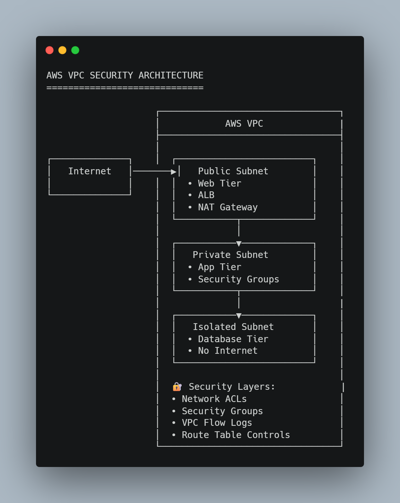

# 🌐 AWS VPC Security Lab: Network Security Implementation

## Overview
Hands-on implementation of AWS Virtual Private Cloud (VPC) security with multiple layers of network protection, following defense-in-depth principles.

## 🎯 Objectives
- Design and deploy a secure multi-tier VPC architecture
- Implement network access controls at multiple layers
- Configure logging and monitoring for network traffic
- Establish secure connectivity patterns

## 🏗️ Architecture

## 🔧 Technologies & Services
- **AWS VPC** (Virtual Private Cloud)
- **Security Groups** (Instance-level firewall)
- **Network ACLs** (Subnet-level firewall)
- **VPC Flow Logs** (Network traffic logging)
- **NAT Gateway** (Outbound internet access)
- **Bastion Host** (Secure administrative access)

## 📁 Repository Structure

## 🚀 Implementation

### 1. VPC Design
- **CIDR Block:** 10.0.0.0/16
- **Public Subnets:** 10.0.1.0/24, 10.0.2.0/24 (for web tier)
- **Private Subnets:** 10.0.3.0/24, 10.0.4.0/24 (for application/database tier)
- **Isolated Subnets:** 10.0.5.0/24 (for management/bastion)

### 2. Security Layers
| Layer | Component | Purpose |
|-------|-----------|---------|
| 1 | **Network ACLs** | Subnet-level traffic filtering |
| 2 | **Security Groups** | Instance-level stateful firewall |
| 3 | **VPC Flow Logs** | Network traffic monitoring |
| 4 | **Route Tables** | Controlled routing between tiers |

### 3. Key Configurations
- **Security Groups:** Minimal allow rules (only required ports)
- **NACLs:** Stateless filtering with explicit deny at end
- **VPC Endpoints:** Private connectivity to AWS services
- **Bastion Host:** SSH access via Session Manager (no open ports)

## 🔐 Security Best Practices
- ✅ **Network Segmentation:** Clear separation between tiers
- ✅ **Least Privilege:** Minimal necessary network access
- ✅ **Defense in Depth:** Multiple security layers
- ✅ **Monitoring:** Comprehensive logging enabled
- ✅ **No Direct Internet Access:** For private resources

## 📊 Results Achieved
- Isolated database tier with no internet access
- Web tier accessible only on HTTP/HTTPS ports
- Administrative access only through bastion host
- Full traffic visibility via VPC Flow Logs

## 🧠 Lessons Learned
1. **NACLs vs Security Groups:** NACLs are stateless, SGs are stateful
2. **VPC Peering:** Non-transitive relationships
3. **Flow Logs:** Can be enabled at VPC, subnet, or ENI level
4. **Cost Considerations:** NAT Gateway charges per hour + data processed

## 🔮 Next Steps
- [ ] Implement VPC Endpoints for S3/DynamoDB
- [ ] Add Transit Gateway for multi-VPC connectivity
- [ ] Implement AWS Network Firewall
- [ ] Create automated security compliance checks

## 📸 Implementation Proof
Screenshots of the implemented configuration are available in the [screenshots/](screenshots/) folder:
- AWS Console configurations
- Service dashboards
- Security settings

---

## 👨‍💻 About
**Renaldi** | Cloud Security Learner  
[GitHub Profile](https://github.com/SilentVeil) | [LinkedIn](https://linkedin.com/in/yourprofile)

*Note: This project was completed as part of hands-on cloud security training.*
